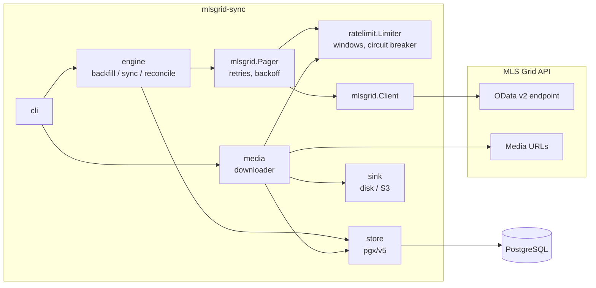
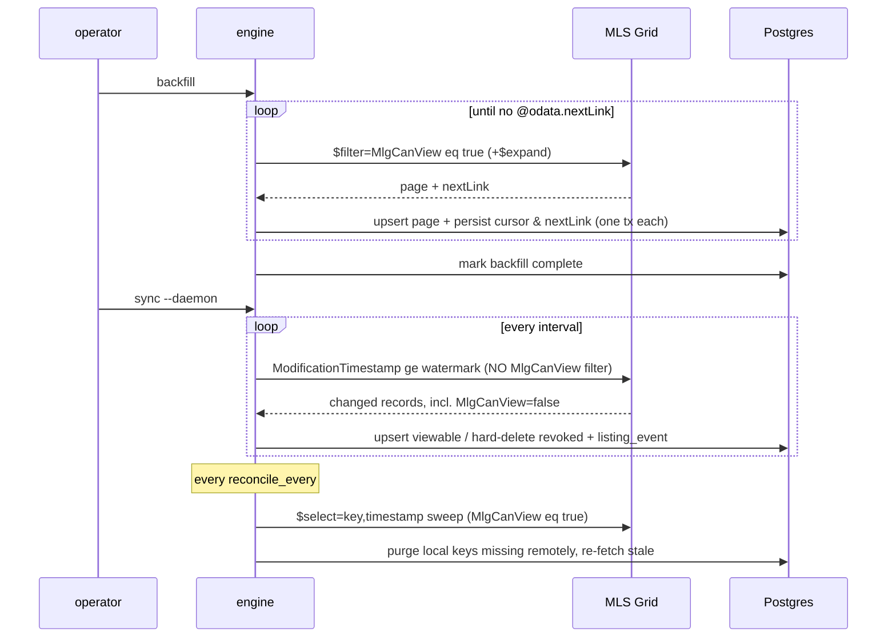

# Architecture

How mlsgrid-sync replicates an MLS Grid feed into PostgreSQL, and why it is
built the way it is. The schema itself is specified separately in
[schema-contract.md](schema-contract.md); MLS Grid's rules are summarized in
[compliance.md](compliance.md).

## Components

Every request — feed page or media file — passes through one shared rate
limiter, so the process as a whole stays inside the account's budget no
matter which subsystem is busy.

## Replication lifecycle

Three passes cover the feed's full delivery semantics:

- **Backfill** imports everything currently viewable. It is resumable (the
  `@odata.nextLink` persists after every page transaction) and boundable
  (`--since`, `--max-pages`) for trials or shared-budget tokens.
- **Incremental sync** follows the `ModificationTimestamp` cursor. It
  deliberately omits the `MlgCanView` filter: revoked records must arrive so
  they can be hard-deleted — a license obligation, not housekeeping.
- **Reconcile** is the safety net. Revoked records only stay in the feed for
  a limited window (about seven days); deletions that happen while sync
  isn't running are caught by periodically sweeping every remote key and
  purging local rows the feed no longer returns.

## Cursor semantics

The replication cursor lives in a dedicated `sync_state` row per
(resource, originating system) — never derived from the data itself.

- **`ge`, not `gt`.** The API truncates timestamps to milliseconds; multiple
  records can share a cursor value. `ge` re-reads the boundary and idempotent
  upserts make the overlap free. `gt` silently loses same-millisecond
  records.
- **An empty cursor never means "fetch everything".** `sync` refuses to run
  without a completed backfill and a non-NULL watermark (`ErrBackfillRequired`).
  Deriving the cursor from `MAX(modification_timestamp)` over an empty table
  is how a production system once re-downloaded an entire feed and got its
  account suspended.
- **Watermarks advance only after the page's transaction commits.** A crash
  loses at most one page of work, and re-processing it is idempotent.
- **The `$skip` wall.** Deep pagination dies around 500K records; a stale
  `nextLink` 400s. Both recover the same way: rebuild a timestamp-filtered
  URL from the watermark (the feed is ordered by `ModificationTimestamp`, so
  everything before the watermark is already stored). One rebuild per
  failure — a second consecutive 400 is a real error.

## Rate limiting

MLS Grid enforces requests/second, hourly and daily request counts, and an
hourly download-byte budget; violations suspend the token. The limiter
mirrors all four client-side, with three properties that matter:

1. **Windows align to the UTC wall clock**, not process start — that is how
   the server accounts them. A process-relative window under-counts after
   every restart.
2. **Window counters persist** to the `rate_budget` table and restore on
   startup, so a crash-looping process cannot launder its usage.
3. **A circuit breaker opens after repeated 429s** and the process halts
   loudly. Retrying through a suspension only extends it. The daemon exits
   on an open circuit rather than backing off forever, and the systemd unit
   caps restarts for the same reason.

Config that exceeds the published caps is refused at load time.

## Schema strategy: core columns + `raw` JSONB

Each Property row has ~75 typed core columns (RESO Data Dictionary names)
plus a `raw` JSONB column holding the rest of the record.

Two alternatives were rejected:

- **A column for every field** couples the schema to every MLS's field
  census. A ~260-column table with positional parameters means every new
  field touches half a dozen places, and an MLS renaming fields (below)
  breaks it wholesale.
- **A `$metadata`-driven dynamic schema** gives downstream consumers no
  stable contract to build against and requires runtime migrations.

The middle ground keeps the high-value fields queryable and typed while
`raw` absorbs feed variance losslessly. What survives into `raw` is the
operator's choice — the [field scope](../README.md#field-scopes) — because
the long tail costs real storage at millions of rows, and different uses
need different tails. Adding a core column later touches exactly two
places: the table-driven field map and a migration.

**Field renames** are handled by per-MLS alias maps. MRED renamed many
local `MRD_*` fields to RESO names in April 2025 — for new records only,
and MLS Grid instructs consumers not to re-pull older ones, so both
spellings coexist in any long-lived replica. The alias map folds both into
the same core column; `raw` keeps whichever key actually arrived.

**Change history** is captured at upsert time into `listing_event`
(new listing, price change, status change, back on market, delisted) by
diffing each incoming record against the stored row inside the same
transaction. MLS Grid has no history API — best-effort capture from first
sync forward is the only price/status history a replica can offer.

## Media

Listing photos are metadata-only by default. In download mode, discovered
media rows queue as `pending` and a bounded worker pool drains them into a
disk or S3-compatible sink. Design constraints:

- Downloads send the access token as `User-Agent` (an MLS Grid requirement)
  and count against the same byte budget as the feed.
- MediaKeys are immutable upstream — a changed image arrives as a new key —
  so a downloaded key is never fetched twice, and re-syncing a listing never
  resets download state.
- Feeds routinely reference dead media hosts. A failing URL marks the row
  and moves on (parked as `failed` after 3 attempts); it never blocks the
  queue. Only systemic conditions — open circuit, failing sink or database —
  abort a run.
- Deleting a revoked listing removes its downloaded files from the sink in
  the same operation.

## Testing

- **No test touches api.mlsgrid.com.** Every feed behavior — paging,
  revocations, type quirks, alias spellings — is a synthetic fixture in
  `testdata/odata/`, replayed through `httptest`. Each production quirk that
  shaped the code has a fixture that fails if the handling regresses.
- **The schema is enforced by a golden test**: the store's migrations run in
  a testcontainers Postgres and the resulting `information_schema` dump must
  match the checked-in golden file, keeping DDL and the contract document
  honest with each other.
- **The rate limiter is tested against a fake clock**, including window
  rollover, byte exhaustion, Retry-After, and circuit behavior.

## Appendix: lessons this design encodes

Each of these caused a real incident in a production MLS Grid consumer the
authors ran previously; the design above exists so they cannot recur.

| Incident | Design answer |
|---|---|
| Empty table made `MAX(timestamp)` cursor zero → full re-download → account suspended | `sync_state` table; sync refuses empty cursors outright |
| `gt` cursor on millisecond-truncated timestamps silently skipped records | `ge` + idempotent upserts |
| Rate windows reset on process restart, under-counting usage | UTC wall-clock windows, persisted to the database |
| No 429/`Retry-After` handling; retries hammered a throttled token | Retry-After honored, exponential backoff, circuit breaker that halts |
| 259-parameter positional upsert; every new field touched 5 places | one table-driven field→column map |
| Media orphan cleanup ran on an empty incoming array, deleting everything | children replaced only when the expansion is non-empty |
| Daemon exited on catch-up under `Restart=on-failure` → sync silently stopped | `--daemon` never exits on "nothing to do"; health endpoint reports staleness |
| A dead media host blocked the whole download queue | per-URL failure tolerance with a 3-strike park |
